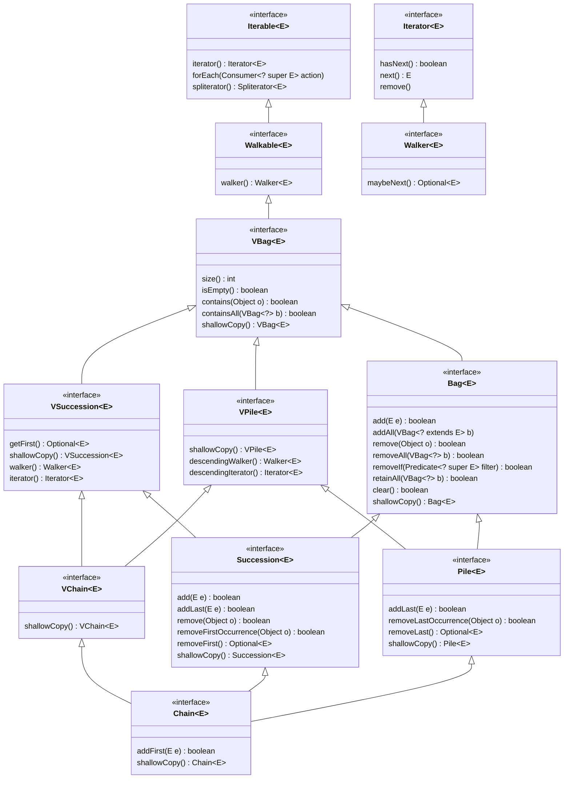

```mermaid
classDiagram

Iterable~E~ <|-- Walkable~E~
Walkable~E~ <|-- VBag~E~
VBag~E~ <|-- VSuccession~E~
VBag~E~ <|-- VPile~E~
VSuccession~E~ <|-- VChain~E~
VPile~E~ <|-- VChain~E~

VBag~E~ <|-- Bag~E~
VSuccession~E~ <|-- Succession~E~
VPile~E~ <|-- Pile~E~
VChain~E~ <|-- Chain~E~

Bag~E~ <|-- Succession~E~
Bag~E~ <|-- Pile~E~
Succession~E~ <|-- Chain~E~
Pile~E~ <|-- Chain~E~

Iterator~E~ <|-- Walker~E~

class Iterable~E~ {
<<interface>>
iterator() Iterator~E~
forEach(Consumer~? super E~ action)
spliterator() Spliterator~E~
}

class Iterator~E~ {
<<interface>>
hasNext() boolean
next() E
remove()
}

class Walkable~E~ {
<<interface>>
walker() Walker~E~
}

class Walker~E~ {
<<interface>>
maybeNext() Optional~E~
}

class VBag~E~ {
<<interface>>
size() int
isEmpty() boolean
contains(Object o) boolean
containsAll(VBag~?~ b) boolean
shallowCopy() VBag~E~
}

class VSuccession~E~ {
<<interface>>
getFirst() Optional~E~
shallowCopy() VSuccession~E~
walker() Walker~E~
iterator() Iterator~E~
}

class VPile~E~ {
<<interface>>
shallowCopy() VPile~E~
descendingWalker() Walker~E~
descendingIterator() Iterator~E~
}

class VChain~E~ {
<<interface>>
shallowCopy() VChain~E~
}

class Bag~E~ {
<<interface>>
add(E e) boolean
addAll(VBag~? extends E~ b)
remove(Object o) boolean
removeAll(VBag~?~ b) boolean
removeIf(Predicate~? super E~ filter) boolean
retainAll(VBag~?~ b) boolean
clear() boolean
shallowCopy() Bag~E~
}

class Succession~E~ {
<<interface>>
add(E e) boolean
addLast(E e) boolean
remove(Object o) boolean
removeFirstOccurrence(Object o) boolean
removeFirst() Optional~E~
shallowCopy() Succession~E~
}

class Pile~E~ {
<<interface>>
addLast(E e) boolean
removeLastOccurrence(Object o) boolean
removeLast() Optional~E~
shallowCopy() Pile~E~
}

class Chain~E~ {
<<interface>>
addFirst(E e) boolean
shallowCopy() Chain~E~
}
```
